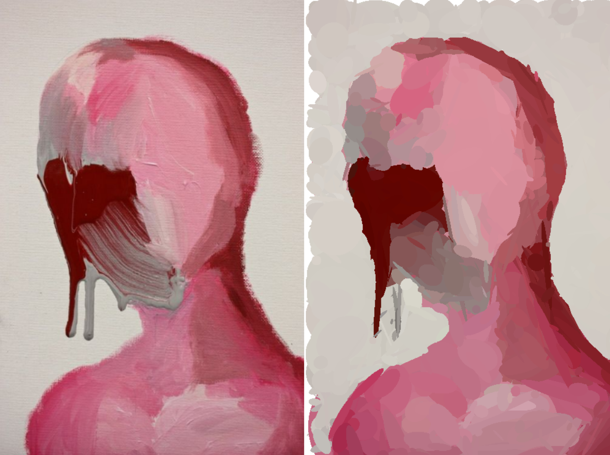
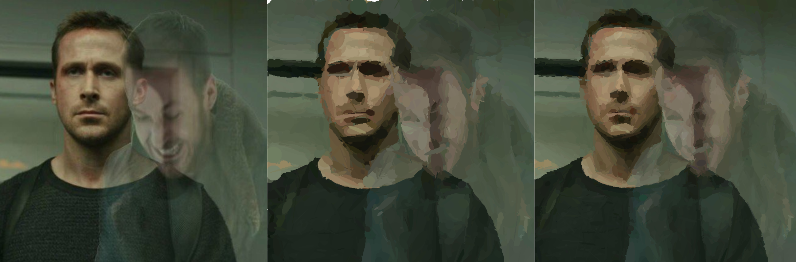
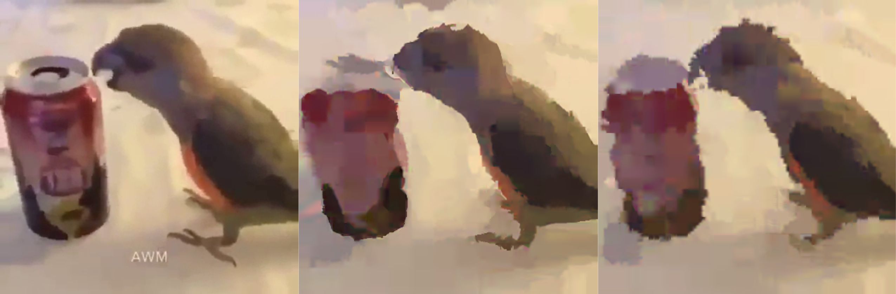

# ImageEvo

Approximate images by evolving random shapes

## Description

The program generates semi-random shapes and uses a simple fitness function to measure the quality of the approximation. Each shape gets mutated to increase the likelihood of finding a good fit. The best fit gets used as the baseline for the next generation. With the help of multithreading and downsampling it is possible to generate up to 30 images per second. With further optimizations it would be possible to use this 'filter' as part of a real-time rendering pipeline.

## Examples

<p align="center">
  
</p>
<p align="center">
  
</p>
<p align="center">
  
</p>

## Building

Install dependencies: ```SDL2, OpenCV```

``` mkdir build && cd build ```

``` cmake .. && cmake --build . ```

## Experimental

* OpenGL implementation with triangles instead of ellipses

* CUDA implementation

Both experimental implementations are currently incomplete and very inefficient.

